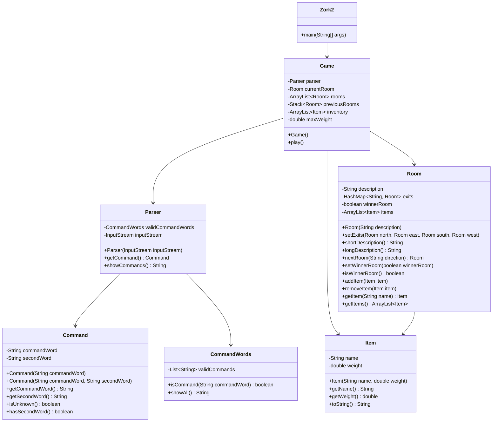

# Zork 2 – Klassendiagramm

```mermaid
classDiagram

class Zork2 {
    +main(String[] args)
}

class Game {
    -Parser parser
    -Room currentRoom
    -ArrayList~Room~ rooms
    -Stack~Room~ previousRooms
    -ArrayList~Item~ inventory
    -double maxWeight
    +Game()
    +play()
}

class Room {
    -String description
    -HashMap~String, Room~ exits
    -boolean winnerRoom
    -ArrayList~Item~ items
    +Room(String description)
    +setExits(Room north, Room east, Room south, Room west)
    +shortDescription() String
    +longDescription() String
    +nextRoom(String direction) Room
    +setWinnerRoom(boolean winnerRoom)
    +isWinnerRoom() boolean
    +addItem(Item item)
    +removeItem(Item item)
    +getItem(String name) Item
    +getItems() ArrayList~Item~
}

class Item {
    -String name
    -double weight
    +Item(String name, double weight)
    +getName() String
    +getWeight() double
    +toString() String
}

class Parser {
    -CommandWords validCommandWords
    -InputStream inputStream
    +Parser(InputStream inputStream)
    +getCommand() Command
    +showCommands() String
}

class Command {
    -String commandWord
    -String secondWord
    +Command(String commandWord)
    +Command(String commandWord, String secondWord)
    +getCommandWord() String
    +getSecondWord() String
    +isUnknown() boolean
    +hasSecondWord() boolean
}

class CommandWords {
    -List~String~ validCommands
    +isCommand(String commandWord) boolean
    +showAll() String
}

Zork2 --> Game
Game --> Parser
Game --> Room
Game --> Item
Parser --> Command
Parser --> CommandWords
Room --> Item
```